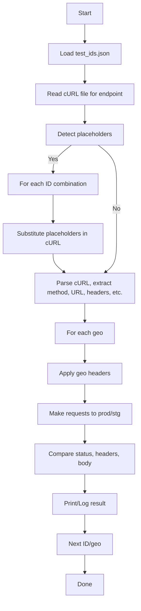

# API Endpoint Comparison Framework — Advanced Guide

## Introduction
This project provides a robust, reusable framework for comparing API responses (across prod, staging, etc.) for any endpoint, geo, and set of IDs (series, match, video, etc.). It is designed for teams and testers who need to validate API rewrites, geo-specific logic, or simply ensure consistency across environments.

---

## Project Structure

```
STGroutes/
├── compare_endpoints.py      # Main generic comparison script
├── curl_parser.py           # cURL parsing logic (reusable)
├── body_compare.py          # JSON/text diff logic (reusable)
├── geo_utils.py             # Geo/country header logic (reusable)
├── test_ids.json            # All IDs to test (series, match, video, etc.)
├── README.md                # Quickstart/basic usage
├── README_ADVANCED.md       # (This file) Detailed advanced guide
├── curl_templates/
│   ├── prod/
│   │   ├── <endpoint>.curl
│   ├── stg/
│   │   ├── <endpoint>.curl
│   └── ...
```

---

## Reporting: Past, Present, Future

### Past
- Console-based or basic Markdown output, with ad-hoc logic for diffs and summaries.
- No interactive or property-level diffing.

### Present
- **Unified report builder** (`report_builder.py`) generates both HTML and Markdown reports.
- **HTML reports** feature an interactive, property-level JSON diff viewer (powered by `jsondiffpatch`), with expandable/collapsible UI and clickable summaries.
- **Markdown reports** use the same summary logic as HTML, ensuring consistency and clarity.
- All summary/diff logic is centralized for maintainability.

### Future
- Web dashboard for browsing historical reports.
- PDF export, notifications, and advanced analytics.
- Further UI and summary customizations as the project grows.

## How the Framework Works — Detailed Flow

1. **ID Management**
    - All test IDs (series, match, video, etc.) are managed centrally in `test_ids.json`.
    - You can add as many ID types as you need (e.g., `player_ids`, `team_ids`).

2. **Endpoint Configuration**
    - Each endpoint or test case has its own `.curl` file.
    - Use placeholders like `<SERIES_ID>`, `<MATCH_ID>`, `<VIDEO_ID>` wherever substitution is needed.
    - If an endpoint requires no ID, just use the URL as-is.

3. **Automated Substitution & Execution**
    - The script auto-detects placeholders in the cURL file.
    - For each placeholder, it substitutes all possible values from `test_ids.json` (including all combinations if multiple IDs are present).
    - For each ID combination, the script runs the request for every geo defined in `geo_utils.py`.
    - For each geo & ID combination, it compares prod vs stg (if both provided), or just prod.
    - Results are printed for each geo and each ID combination, with detailed diffs.

4. **Comparison Logic**
    - Status code, headers (ignoring volatile fields), and response body are compared.
    - JSON responses are pretty-printed and normalized (e.g., dynamic fields masked) before diffing.
    - Non-JSON responses are compared as text.

---

## Advanced Flow Diagram



---

## Step-by-Step: Adding a New Test/Endpoint

### 1. Create a cURL File
- Copy a real cURL from browser/devtools or write it manually.
- Use `<SERIES_ID>`, `<MATCH_ID>`, `<VIDEO_ID>`, etc. for any IDs you want to substitute.
- Save as `<endpoint>.curl` (e.g., `match_scorecard.curl`).

### 2. Update test_ids.json
- Add or update lists of IDs as needed.
- You can have as many types as you want (e.g., `player_ids`, `team_ids`), just keep the plural naming convention.

### 3. Run the Script
- For prod only:
  ```bash
  python compare_endpoints.py --prod-file match_scorecard.curl
  ```
- For prod vs stg:
  ```bash
  python compare_endpoints.py --prod-file match_scorecard.curl --stg-file match_scorecard_stg.curl
  ```
- Optionally specify a different IDs file:
  ```bash
  python compare_endpoints.py --prod-file ... --ids-file my_ids.json
  ```

### 4. Interpret Results
- Output is grouped by geo and ID combination.
- Diffs are shown for status, headers, and body (JSON/text).
- For large diffs, consider redirecting output to a file.

---

## Best Practices & Tips

- **Always use placeholders** for IDs in cURL files if you want to test multiple values.
- **Keep test_ids.json up to date** with all IDs you want to test.
- **Use one cURL file per endpoint/test case** for clarity and modularity.
- **Add new geo/country logic in geo_utils.py** if your product expands to more regions.
- **For endpoints with no IDs**, just use the URL as-is in the cURL file.
- **For endpoints with multiple IDs**, the script will generate all combinations (cartesian product).
- **If you want to skip certain IDs/geos**, filter them in test_ids.json or geo_utils.py.
- **If you want HTML/Markdown reports**, extend the script or post-process the output.

---

## Example: Adding a New Endpoint

1. Copy a real cURL for the endpoint (e.g., match scorecard) to `match_scorecard.curl`.
2. Replace any IDs with placeholders (e.g., `<MATCH_ID>`).
3. Update `test_ids.json` with all match IDs you want to test.
4. Run:
   ```bash
   python compare_endpoints.py --prod-file match_scorecard.curl
   ```
5. Review the output for diffs by geo and match ID.

---

## For New Testers: Quick Checklist

- [ ] Did you copy the real cURL and use placeholders for IDs?
- [ ] Did you update `test_ids.json` with all IDs you want to test?
- [ ] Did you run the script with the right cURL file?
- [ ] Did you check the output for diffs?
- [ ] Did you ask for help if something was unclear?

---

## FAQ (Advanced)

**Q: Can I test endpoints with multiple IDs (e.g., series + match)?**
A: Yes! Use both `<SERIES_ID>` and `<MATCH_ID>` in your cURL. The script will try all combinations.

**Q: What if my endpoint needs a new kind of ID?**
A: Add a new key (e.g., `player_ids`) to `test_ids.json` and use `<PLAYER_ID>` in your cURL.

**Q: Can I skip certain geos or IDs?**
A: Remove them from `test_ids.json` or comment them out in `geo_utils.py`.

**Q: Can I generate a report?**
A: Redirect output to a file, or extend the script to write Markdown/HTML.

---

## Maintainers & Contact
- For help, contact the repo owner or check code comments.
- Contributions and suggestions welcome!
